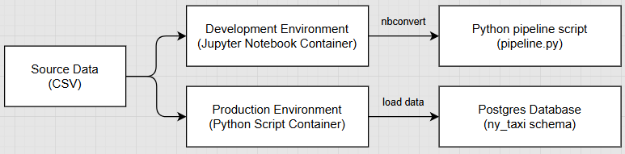
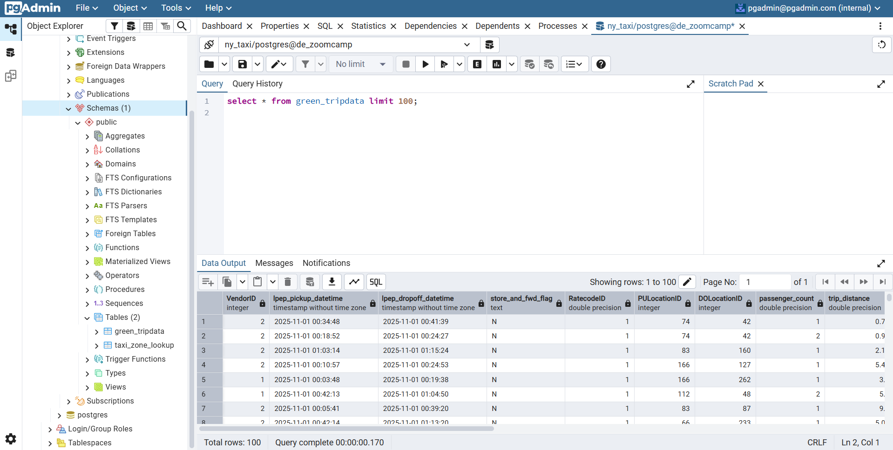
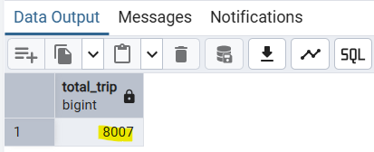
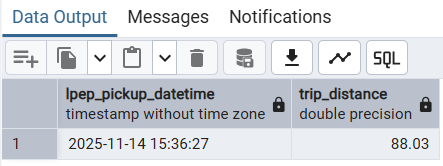
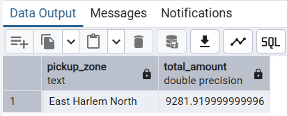
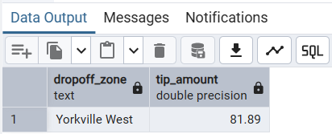

# Module 1: Docker & Data Ingestion Using Postgres
## 📝 Homework
### Question 1. Understanding Docker Images 
> Q1: Run docker with the python:3.13 image. Use an entrypoint bash to interact with the container.
> What's the version of pip in the image?

1. Creating a Docker image Python 3.13
```bash
docker run -it --rm \
  -v $(pwd):/app \
  --entrypoint=bash \
  python:3.13

```
2. Check the pip version
```bash
pip --version
```

**✅ Answer**: <br>
The pip version of the Python 3.13 Docker image is **25.3**


---
### Question 2. Understanding Docker Networking and Docker-Compose
> Given the following docker-compose.yaml, 
> what is the hostname and port that pgadmin should use to connect to the postgres database?

1. Create ``docker-compose.yaml``
fill the file with the existing script from the question
```bash
services:
  # this is container for postgres (the database)
  db: #hostname
    container_name: postgres #container name in docker
    image: postgres:17-alpine
    environment:
      POSTGRES_USER: 'postgres'  #postgres username
      POSTGRES_PASSWORD: 'postgres'  #postgres password
      POSTGRES_DB: 'ny_taxi'  #postgres db name
    ports:
      - '5433:5432'   #port on host machine : port inside the container
    volumes:
      - vol-pgdata:/var/lib/postgresql/data

  # this is container for pgadmin (GUI database)
  pgadmin:
    container_name: pgadmin
    image: dpage/pgadmin4:latest
    environment:
      PGADMIN_DEFAULT_EMAIL: "pgadmin@pgadmin.com"   # use this to login into pgadmin4
      PGADMIN_DEFAULT_PASSWORD: "pgadmin"  # use this to login into pgadmin4
    ports:
      - "8080:80"   # this is port to access to our pgadmin, http://localhost:8080
    volumes:
      - vol-pgadmin_data:/var/lib/pgadmin

volumes:
  vol-pgdata:
    name: vol-pgdata
  vol-pgadmin_data:
    name: vol-pgadmin_data
```
2. Run the docker-compose.yaml
```bash
docker compose up -d
```
3. Run pgadmin4 
Access pgAdmin in browser by browsing to `http://localhost:8080`, and login into pgadmin using `PGADMIN_DEFAULT_EMAIL` and `PGADMIN_DEFAULT_PASSWORD` state in the `docker-compose.yaml` file.

4. Create new server
Register the server connection refers to our configuration on the `docker-compose.yaml`:
- hostname : `db`
- port : `5432`
- username : `postgres`
- password : `postgres`


**✅ Answer**: <br>
Based on the docker-compose.yaml, the right choice is `db:5432`

---
### Data Ingestion to Answer Q3-Q6
To prepare the data needed for answering Question 3 to Question 6, I implemented a containerized data pipeline using Docker. The goal of this ingestion is to reliably download CSV data, process it in batches using Python, and load it into a PostgreSQL database for further analysis. 

**Workflow** <br>
 <br>
This workflow follows a two-phase approach:
1. Development Phase 
   Purpose: Explore and validate ingestion logic safely
   What happened here:
   - Inspect CSV data
   - Testing database connection
   - Experiment with batch size logic
   - Prototype insert logic data
   Output: converted notebook script (.ipynb) into python script (.py) → `pipeline.py`

2. Production Phase 
   Purpose: Load data in a repeatable, deterministic, and scalable way
   What happened here:
   - pipeline.py reads raw CSV files
   - Data is inserted into PostgreSQL in batches
   - Script runs via Docker container
   - Can be scheduled or orchestrated later

**Output** <br>
Data ingestion completed successfully. <br>


---
### Question 3. Counting Short Trips
> Q3 : For the trips in November 2025 (lpep_pickup_datetime between '2025-11-01' and '2025-12-01', 
> exclusive of the upper bound), how many trips had a trip_distance of less than or equal to 1 mile?`

Query: <br>
```sql
select 
	COUNT(*) as total_trip
from 
	green_tripdata 
where 
	  lpep_pickup_datetime >= '2025-11-01'
  and
	  lpep_pickup_datetime < '2025-12-01'
  and 
    trip_distance <= 1;
```

**✅ Answer**:<br>


---
### Question 4. Longest Trip for Each Day
> Q4: Which was the pick up day with the longest trip distance? 
> Only consider trips with trip_distance less than 100 miles (to exclude data errors).

Query: <br>
```sql
select 
	lpep_pickup_datetime, trip_distance
from 
	green_tripdata 
where 
  	trip_distance < 100
order by 
	trip_distance desc
limit 1;
```

**✅ Answer**:<br>


---
### Question 5. Biggest Pickup Zone
> Q5: Which was the pickup zone with the largest total_amount (sum of all trips) on November 18th, 2025?

Query: <br>
```sql
select 
	z."Zone" as pickup_zone,
	sum(g.total_amount) as total_amount
from 
	green_tripdata as g
join
	taxi_zone_lookup as z
on 
	g."PULocationID" = z."LocationID"
where 
		lpep_pickup_datetime >= '2025-11-18' 
	and 
		lpep_pickup_datetime < '2025-11-19'
group by pickup_zone
order by total_amount desc
limit 1;
```

**✅ Answer**:<br>


---
### Question 6. Largest Tip
> Q6: For the passengers picked up in the zone named "East Harlem North" in November 2025, 
> which was the drop off zone that had the largest tip?

Query: <br>
```sql
select 
	zdo."Zone" as dropoff_zone,
	max(g.tip_amount) as tip_amount
from 
	green_tripdata as g
join 
	taxi_zone_lookup AS zpu
on 
	g."PULocationID" = zpu."LocationID"
join 
	taxi_zone_lookup AS zdo
on 
	g."DOLocationID" = zdo."LocationID"
where 
	zpu."Zone" like '%East Harlem North%'
and
	lpep_pickup_datetime >= '2025-11-01'
and
	lpep_pickup_datetime < '2025-12-01'
group by 
	dropoff_zone
order by 
	tip_amount DESC
limit 1;
```
**✅ Answer**:<br>


---
### Question 7. Terraform
> Q7: Which of the following sequences, respectively, describes the workflow for:
> 1. Downloading the provider plugins and setting up the backend  
> 2. Generating proposed changes and auto-executing the plan  
> 3. Removing all resources managed by Terraform
>
> Choices:
> - terraform import, terraform apply -y, terraform destroy
> - teraform init, terraform plan -auto-apply, terraform rm
> - terraform init, terraform run -auto-approve, terraform destroy
> - terraform init, terraform apply -auto-approve, terraform destroy
> - terraform import, terraform apply -y, terraform rm

**✅ Answer**: <br>
The correct sequence is:
```terraform init, terraform apply -auto-approve, terraform destroy``` <br>

Explanation: <br>
1. ```terraform init```: Initializes the working directory, downloads the necessary provider plugins, and configures the backend for state storage.
2. ```terraform apply -auto-approve```: Scans the configuration to generate proposed changes and executes them immediately, skipping the manual "yes" confirmation prompt.
3. ```terraform destroy```: Identifies all resources currently managed in the state file and removes them from the infrastructure provider.

## 🔗 Learning Resources
References and learning materials used in this project:
1. [Docker for Data Engineering: Postgres, Docker Compose, and Real-World Workflows - Alexey Grigorev](https://www.youtube.com/watch?v=lP8xXebHmuE)
2. [Docker Compose — Ports documentation](https://docs.docker.com/reference/compose-file/services/#ports)
3. [Terraform Official Documentation](https://developer.hashicorp.com/terraform)
3. [Introduction to Terraform](https://www.youtube.com/watch?v=s2bOYDCKl_M&list=PL3MmuxUbc_hJed7dXYoJw8DoCuVHhGEQb&index=12)


