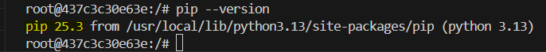

# HomeWork 1: Docker & Data Ingestion Using Postgres

### Question 1. Understanding Docker images 
#### 1. Creating a Docker image Python 3.13
```bash
docker run -it --rm --entrypoint=bash python:3.13
```
#### 2. Check the pip version
```bash
pip --version
```

#### Result
The pip version of the Python 3.13 Docker image is **25.3**


### Question 2. Understanding Docker networking and docker-compose


