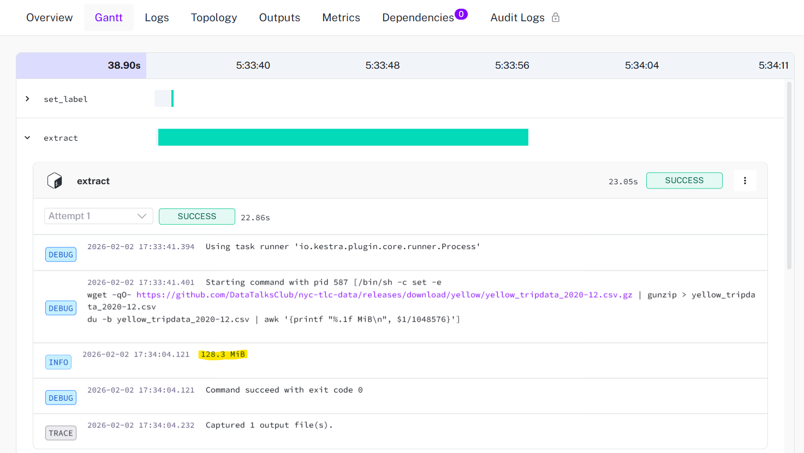
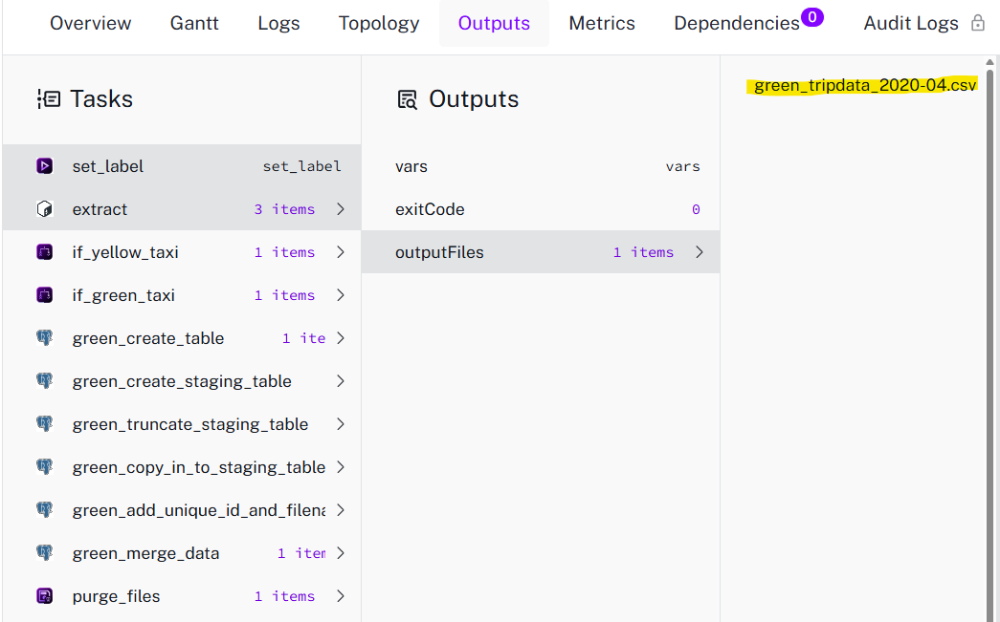

# Module 2: Workflow Orchestration with Kestra
## Overview
This repository contains my solutions for Module 2 of the Data Engineering Zoomcamp. In this module, I focused on workflow orchestration, learning how to automate, schedule, and backfill data pipelines using Kestra. I also gained hands-on experience integrating Kestra with PostgreSQL and managing dynamic variables within ETL workflows.

### Tech Stack
- Kestra — Workflow orchestration and data pipeline management
- Docker & Docker Compose — Containerized environment for running Kestra and PostgreSQL
- PostgreSQL — Target database (data warehouse) for NYC Taxi data
- pgAdmin — Database management tool for data validation and SQL query execution

## 📝 Homework
### Question 1. File Sized
> Within the execution for Yellow Taxi data for the year 2020 and month 12: what is the uncompressed file size 
> (i.e. the output file yellow_tripdata_2020-12.csv of the extract task)?

Steps:
1. Executed a Kestra flow [01_nyctaxi_postgre.yaml](flows/01_nyctaxi_postgre.yaml) with the following inputs: `taxi: yellow`, `year: 2020`, `month:12`.
The extract task was configured as follows to download the dataset and compute and print the uncompressed file size:
```
- id: extract
  type: io.kestra.plugin.scripts.shell.Commands
  outputFiles:
    - "*.csv"
  taskRunner:
    type: io.kestra.plugin.core.runner.Process
  commands:
    - wget -qO- https://github.com/DataTalksClub/nyc-tlc-data/releases/download/{{inputs.taxi}}/{{render(vars.file)}}.gz | gunzip > {{render(vars.file)}}
    - du -b {{render(vars.file)}} | awk '{printf "%.1f MiB\n", $1/1048576}' # Compute the uncompressed file size in MiB
```
2. After the flow executed successfully, inspected the **logs of the extract task** in the Kestra UI to obtain the file size information.


**✅ Answer**: <br>
The uncompressed file size from yellow taxi at December 2020 is **128.3 MiB**
<hr>

### Question 2. Pebble Templates on Kestra
> What is the rendered value of the variable file when the inputs taxi is set to green, year is set to 2020, 
> and month is set to 04 during execution? 
> - {{inputs.taxi}}_tripdata_{{inputs.year}}-{{inputs.month}}.csv
> - green_tripdata_2020-04.csv
> - green_tripdata_04_2020.csv
> - green_tripdata_2020.csv

Kestra uses Pebble templates to dynamically build strings. <br>
Using this expression: `{{inputs.taxi}}_tripdata_{{inputs.year}}-{{inputs.month}}.csv`, the variables are replaced as what we input. 
- `{{inputs.taxi}}` --> `green`
- `{{inputs.year}}` --> `2020`
- `{{inputs.month}}` --> `04`

 <br>

Code:
```
variables:
  file: "{{inputs.taxi}}_tripdata_{{inputs.year}}-{{inputs.month}}.csv" # Defines the filename pattern; used to verify variable rendering
  staging_table: "public.{{inputs.taxi}}_tripdata_staging"
  table: "public.{{inputs.taxi}}_tripdata"
  data: "{{outputs.extract.outputFiles[inputs.taxi ~ '_tripdata_' ~ inputs.year ~ '-' ~ inputs.month ~ '.csv']}}"
```

**✅ Answer**: <br>
The rendered output value of the variable file when the inputs taxi is set to green, year is set to 2020, 
and month is set to 04 is **green_tripdata_2020-04.csv**

<hr>

### Preparation to Answer Q3-Q5 
To answer Q3-Q5, I performed backfilling operation in Kestra to ingest historical data from year of 2020 until 2021 into Postgres database. I use [02_nyctaxi_postgre_scheduled.yaml](flows/02_nyctaxi_postgre_scheduled.yaml) flow to perform data ingestion. 

<hr>

### Question 3. Total Row Number of Data of Yellow Taxi on 2020
> How many rows are there for the Yellow Taxi data for all CSV files in the year 2020?

Using this query:
```sql
SELECT COUNT(*) AS total_rows
FROM yellow_tripdata
WHERE EXTRACT(YEAR FROM tpep_pickup_datetime) = 2020;
```

**✅ Answer**: <br>
Number of rows in Yellow Taxi Data for 2020 is **24.648.499 rows**

<hr>

### Question 4. Total Row Number of Data of Green Taxi on 2020
> How many rows are there for the Green Taxi data for all CSV files in the year 2020?

Using this query:
```sql
SELECT COUNT(*) AS total_rows
FROM green_tripdata
WHERE EXTRACT(YEAR FROM lpep_pickup_datetime) = 2020;
```

**✅ Answer**: <br>
Number of rows in Green Taxi Data for 2020 is **1,734,051 rows**

<hr>

### Question 5. Total Row Number of Data of Green Taxi on 2020
> How many rows are there for the Yellow Taxi data for the March 2021 CSV file?

Using this query:
```sql
SELECT COUNT(*) AS total_rows
FROM yellow_tripdata
WHERE tpep_pickup_datetime >= '2021-03-01 00:00:00'
  AND tpep_pickup_datetime < '2021-04-01 00:00:00';
```

**✅ Answer**: <br>
Number of rows in Green Taxi Data for March 2021 is **1,925,152 rows**

<hr>

### Question 6. Timezone Configuration in Schedule Trigger
> How would you configure the timezone to New York in a Schedule trigger?

Refers to the documentation of Schedule Trigger [Documentation](https://kestra.io/docs/workflow-components/triggers/schedule-trigger), to config timezone in Schedule Trigger we can code like this: <br>

```
triggers:
  - id: green_schedule
    type: io.kestra.plugin.core.trigger.Schedule
    cron: "0 9 1 * *"
    timezone: America/New_York # timezone identifier; handles DST offsets automatically for New York
    inputs:
      taxi: green

  - id: yellow_schedule
    type: io.kestra.plugin.core.trigger.Schedule
    cron: "0 10 1 * *"
    timezone: America/New_York #  timezone identifier; handles DST offsets automatically for New York
    inputs:
      taxi: yellow
```

**✅ Answer**: <br>
To config the timezone to New York in a Schedule trigger, we can **add a timezone property set to America/New_York**


