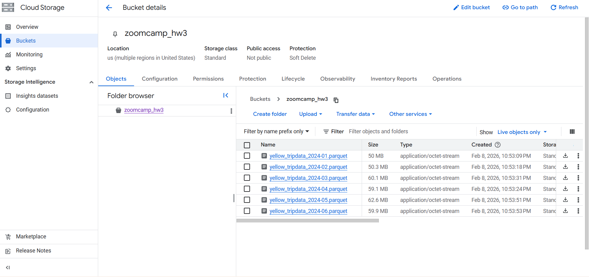
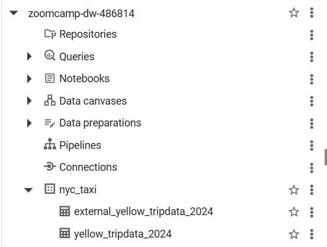
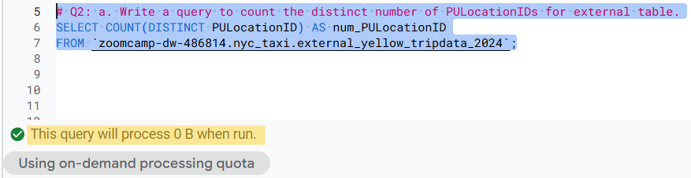
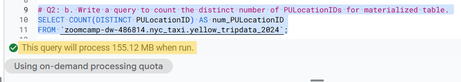
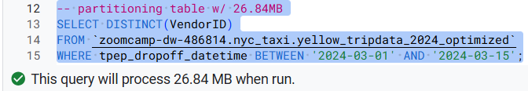
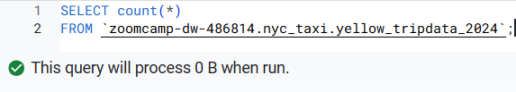

# Module 3: Data Warehouse
## Overview
This repository contains my solutions for Module 3 of the Data Engineering Zoomcamp. In this module, I explored data warehousing and analytics using Google BigQuery, covering data ingestion, external vs materialized tables, and dataset/schema management. I analyzed query performance using bytes processed and applied partitioning and clustering strategies to optimize query efficiency and reduce storage and compute costs.

### Tech Stack
- Google Cloud Storage (GCS) — Cloud object storage for raw data
- Google BigQuery — Serverless data warehouse for analytics, partitioning, and clustering

## 📝 Homework
### Preparation: GCP Setup 
For this homework we will be using the Yellow Taxi Trip Records for January 2024 - June 2024 that can be found here: https://www.nyc.gov/site/tlc/about/tlc-trip-record-data.page

Steps:
To do the homework, we need to setup GCP and load the data into Google Cloud Storage. 
1. Load data into Google Cloud Storage
- Create new project in the Google Cloud Platform. In this case, i used `zoomcamp-dw` as my project name
- Create a GCS bucket in the project, mine is `zoomcamp_hw3`
- Authenticate using Google Cloud SDK (ADC). I used ADC instead using credentials file.
```bash
gcloud auth login
gcloud config set project (PROJECT_ID)
gcloud auth application-default login
```
- Using [load_yellow_taxi_data.py](load_yellow_taxi_data.py), update the `project_id` and `bucket_name` based on the GCP configuration.
- Run the python script using:
```bash
python load_yellow_taxi_data.py
```
The script will upload the data to the GCS bucket. A successful run will produce output similar to the following: <br>


2. BigQuery Setup
- Create schema
```sql
CREATE SCHEMA IF NOT EXISTS 
  `zoomcamp-dw-486814.nyc_taxi`
OPTIONS (location = 'US');
```

- Create external table
```sql
CREATE OR REPLACE EXTERNAL TABLE
  `zoomcamp-dw-486814.nyc_taxi.external_yellow_tripdata_2024`
OPTIONS (
  format = 'PARQUET',
  uris = ['gs://zoomcamp_hw3/yellow_tripdata_2024-*.parquet']
);
```

- Create materialized table
```sql
CREATE OR REPLACE TABLE
`zoomcamp-dw-486814.nyc_taxi.yellow_tripdata_2024`
AS
SELECT *
FROM `zoomcamp-dw-486814.nyc_taxi.external_yellow_tripdata_2024`;
```
After completing these steps, the dataset contains both the external table (backed by data in GCS) and the native BigQuery table, as shown below: <br>


<hr>

### Question 1. Counting records
> What is count of records for the 2024 Yellow Taxi Data?
```sql
    SELECT COUNT(*) AS total_records
    FROM `zoomcamp-dw-486814.nyc_taxi.yellow_tripdata_2024`;
```
**✅ Answer**: <br>
count of records for the 2024 Yellow Taxi Data **20,332,093**

<hr>

### Question 2. Data read estimation
> Write a query to count the distinct number of PULocationIDs for the entire dataset on both the tables.
> What is the estimated amount of data that will be read when this query is executed on the External Table and the Table?
>
> - 18.82 MB for the External Table and 47.60 MB for the Materialized Table
> - 0 MB for the External Table and 155.12 MB for the Materialized Table
> - 2.14 GB for the External Table and 0MB for the Materialized Table
> - 0 MB for the External Table and 0MB for the Materialized Table

```sql
# Q2: a. Write a query to count the distinct number of PULocationIDs for external table.
SELECT COUNT(DISTINCT PULocationID) AS num_PULocationID
FROM `zoomcamp-dw-486814.nyc_taxi.external_yellow_tripdata_2024`;

# Q2: b. Write a query to count the distinct number of PULocationIDs for materialized table.
SELECT COUNT(DISTINCT PULocationID) AS num_PULocationID
FROM `zoomcamp-dw-486814.nyc_taxi.yellow_tripdata_2024`;
```
**✅ Answer**: <br>
To check the estimated amount of data processed by a query, select the query in the BigQuery editor. BigQuery will automatically display the estimated bytes to be read before execution.

<p float="left">
  
  
</p>

So, the right answer is  **0 MB for the External Table and 155.12 MB for the Materialized Table**

<hr>

### Question 3. Understanding columnar storage
> Write a query to retrieve the PULocationID from the table (not the external table) in BigQuery. Now write a query to retrieve the PULocationID and DOLocationID on the same table.
>
> Why are the estimated number of Bytes different?
> - BigQuery is a columnar database, and it only scans the specific columns requested in the query. Querying two columns (PULocationID, DOLocationID) requires reading more data than querying one column (PULocationID), leading to a higher estimated number of bytes processed.
> - BigQuery duplicates data across multiple storage partitions, so selecting two columns instead of one requires scanning the table twice, doubling the estimated bytes processed.
> - BigQuery automatically caches the first queried column, so adding a second column increases processing time but does not affect the estimated bytes scanned.
> - When selecting multiple columns, BigQuery performs an implicit join operation between them, increasing the estimated bytes processed

**✅ Answer**: <br>
The estimated number of bytes is different because BigQuery is a columnar database and only scans the columns referenced in the query. The right choice is **BigQuery is a columnar database, and it only scans the specific columns requested in the query. Querying two columns (PULocationID, DOLocationID) requires reading more data than querying one column (PULocationID), leading to a higher estimated number of bytes processed.**

<br>

More Explanation:
The core reason is becuase BigQuery is **Columnar Storage Architecture**. Traditional databases (like PostgreSQL or MySQL) usually store data in rows. If you want one piece of information from a row, the database often has to "read" the entire row into memory to find it. BigQuery does the opposite. It stores each column in its own separate file or block of memory.
- Efficiency: When you run the first query, BigQuery only opens the file containing PULocationID. It completely ignores all other columns (like VendorID, passenger_count, etc.).
- Additive Cost: When you add DOLocationID to your `SELECT` statement, BigQuery now has to open and scan a second set of files. Since you are reading more physical data off the disk, the "Bytes Processed" increases proportionally.
- Pricing Impact: This is exactly why `SELECT *` is considered a "sin" in BigQuery; it forces the engine to scan every single column file in the table, maximizing your costs.

<hr>

### Question 4. Counting zero fare trips
> How many records have a fare_amount of 0?

```sql
SELECT COUNT(vendorID) AS zero_fare_trips
FROM `zoomcamp-dw-486814.nyc_taxi.yellow_tripdata_2024`
WHERE fare_amount = 0;
```
**✅ Answer**: <br>
There are **8333** records having zero fare_amount.

<hr>

### Question 5. Partitioning and Clustering
> What is the best strategy to make an optimized table in Big Query if your query will always filter based on tpep_dropoff_datetime and order the results by VendorID (Create a new table with this strategy)
> - Partition by tpep_dropoff_datetime and Cluster on VendorID
> - Cluster on by tpep_dropoff_datetime and Cluster on VendorID
> - Cluster on tpep_dropoff_datetime Partition by VendorID
> - Partition by tpep_dropoff_datetime and Partition by VendorID

**Explanation**: <br>
To optimize query performance and minimize costs in BigQuery, this strategy implements a combination of Time-unit Partitioning and Clustering, which addresses the two most resource-intensive operations: data scanning and sorting. By partitioning the table on tpep_dropoff_datetime, BigQuery physically segments the data into distinct storage blocks based on date, enabling Partition Pruning where the engine only scans segments relevant to the WHERE clause rather than the entire dataset. Complementing this, clustering the data by VendorID ensures that rows with the same ID are co-located within each partition, which significantly optimizes the ORDER BY operation by pre-sorting the data on disk and reducing the computational overhead of data shuffling. This dual-layered approach ensures that the query engine achieves maximum efficiency in both data retrieval and record organization, making it the ideal architecture for high-frequency analytical workloads involving temporal filters and categorical sorting.
<br>
Query to make partition + clustering: <br>
```sql
CREATE OR REPLACE TABLE `zoomcamp-dw-486814.nyc_taxi.yellow_tripdata_2024_optimized`
PARTITION BY DATE(tpep_dropoff_datetime)
CLUSTER BY VendorID
AS
SELECT * FROM `zoomcamp-dw-486814.nyc_taxi.yellow_tripdata_2024`;
```

**✅ Answer**: <br>
The best strategy is using **Partition by tpep_dropoff_datetime and Cluster on VendorID**.

<hr>

### Question 6. Partition benefits
> Write a query to retrieve the distinct VendorIDs between tpep_dropoff_datetime 2024-03-01 and 2024-03-15 (inclusive)
> Use the materialized table you created earlier in your from clause and note the estimated bytes. Now change the table in the from clause to the partitioned table you created for question 5 and note the estimated bytes processed. What are these values?
>
> Choose the answer which most closely matches.
> - 12.47 MB for non-partitioned table and 326.42 MB for the partitioned table
> - 310.24 MB for non-partitioned table and 26.84 MB for the partitioned table
> - 5.87 MB for non-partitioned table and 0 MB for the partitioned table
> - 310.31 MB for non-partitioned table and 285.64 MB for the partitioned table

<table>
  <tr>
    <th>Non-Partitioned Table</th>
    <th>Partitioned Table</th>
  </tr>
  <tr>
    <td align="center">
      <br>
      Estimated Bytes: 310.24 MB
    </td>
    <td align="center">
      <br>
      Estimated Bytes: 26.84 MB
    </td>
  </tr>
</table>

**✅ Answer**: <br>
Based on above picture, the correct answer is **310.24 MB for non-partitioned table and 26.84 MB for the partitioned table**.

<hr>

### Question 7. External table storage
> Where is the data stored in the External Table you created?
> - Big Query
> - Container Registry
> - GCP Bucket
> - Big Table

**✅ Answer**: <br>
Based on [BigQuery External-Tables Documentation ](https://docs.cloud.google.com/bigquery/docs/external-tables), the external table store in **GCP Bucket**. In BigQuery, an External Table does not store data within the BigQuery native storage engine. Instead, it functions as a metadata layer that points directly to files residing in a GCP Bucket (Google Cloud Storage).

<hr>

### Question 8. Clustering Best Practice
> It is best practice in Big Query to always cluster your data:

**✅ Answer**: <br>
The answer is **False**. While clustering is a powerful optimization tool, it is not a "one-size-fits-all" best practice. Using it blindly can sometimes lead to unnecessary overhead without providing any performance benefits. "Always clustering" is not recommended because:
1. **Small Datasets**: If the table is small (usually less than 1 GB), the performance gains from clustering are negligible. The overhead of maintaining the metadata for clusters might actually make the query slightly slower or more complex than a simple full scan.
2. **High-Churn Data**: If the data is constantly being updated or overwritten, BigQuery has to work harder to maintain the sorted order of the clusters. This can lead to increased background maintenance costs.
3. **Query Patterns/ Analysis Needs**: Clustering only helps if you actually use the clustered columns in your WHERE, ORDER BY, or GROUP BY clauses. If you cluster by VendorID but your queries only ever look at passenger_count, the clustering provides zero benefit.
4. **Cost-Benefit Balance**: For very small tables, BigQuery's "Full Table Scan" is already so fast and cheap that the effort to design and maintain a clustering strategy isn't worth the engineering time.

<hr>

### Question 9. Understanding table scans
> Write a SELECT count(*) query FROM the materialized table you created. How many bytes does it estimate will be read? Why?

<br>
When running a `SELECT count(*)` on a materialized table in BigQuery, the estimated bytes processed will be `0 B`. Because BigQuery does not perform a Table Scan for this query.

BigQuery is a modern data warehouse that maintains extensive Metadata for all its native tables. Metadata is essentially "data about the data" that is stored separately from the actual rows.
 - Metadata Lookup: For a simple `count(*)` without any filters `(WHERE clauses)`, BigQuery simply reads the row_count property from the table's metadata.
 - No Column Access: Since you aren't filtering or selecting specific column values, the execution engine doesn't need to open or scan the columnar storage files (Capacitor).
 - Efficiency: This makes the operation nearly instantaneous and completely free of charge in terms of "bytes processed".


