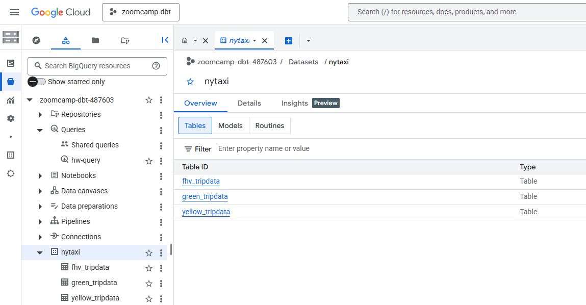
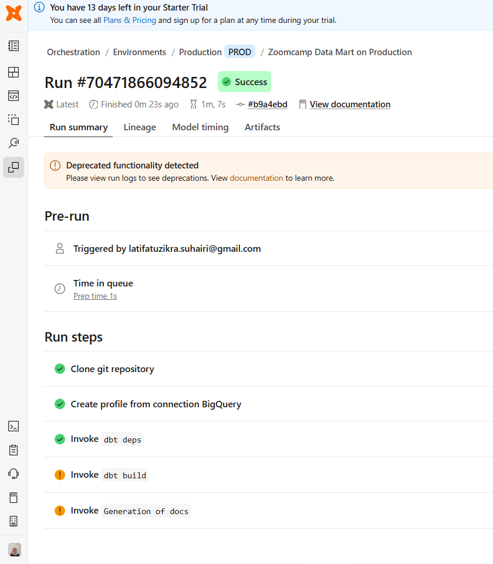
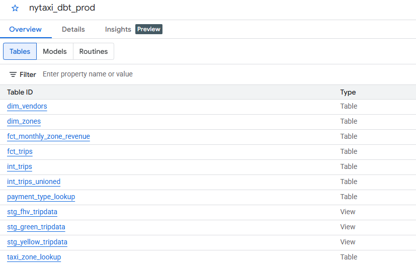
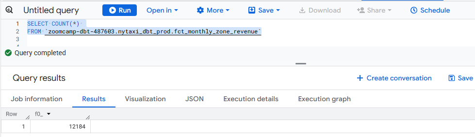
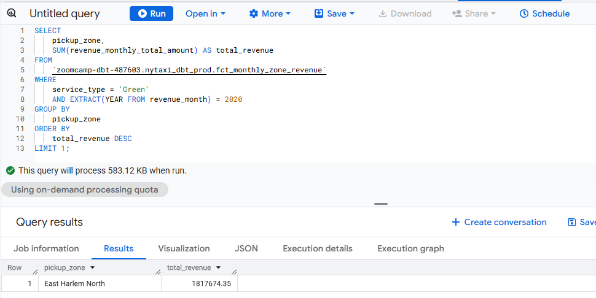
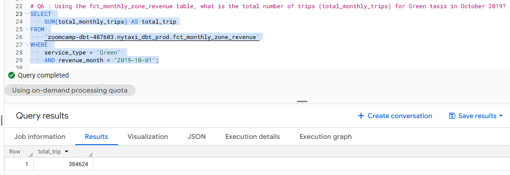
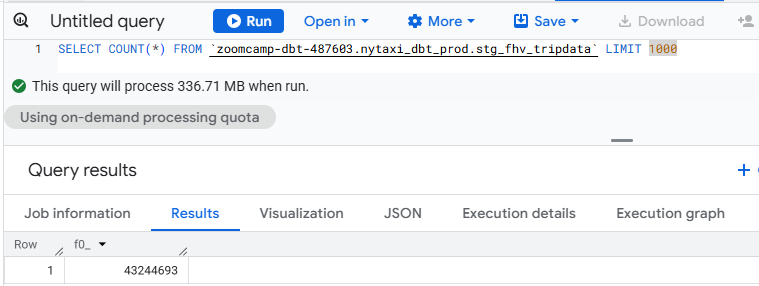

# Module 4: Analytics Engineering
## Overview
This repository contains my solutions for Module 4 (Analytics Engineering) of the Data Engineering Zoomcamp. In this module, I explored data transformation and analytics using dbt (Data Build Tool) and Google BigQuery. I practiced the complete analytics engineering lifecycle: ingesting raw taxi data (Yellow, Green, and FHV) into BigQuery, developing modular staging and fact models, and implementing testing and documentation to ensure data quality.

### Tech Stack
- dbt (cloud version) — For transforming raw data into clean, documented, and tested analytics models.
- Google Cloud Storage (GCS) — Cloud object storage for raw data
- Google BigQuery — Serverless data warehouse for storage and analytics

## 📝 Homework
### Preparation
#### Step 1: Data Ingestion to BigQuery
Using the same approach that we've been learned in Module 3, we need to load following data from [DataTalksClub NYC TLC Data repository](https://github.com/DataTalksClub/nyc-tlc-data/releases) into Bigquery `nytaxi` dataset:
1. Green taxi trip records for all months of 2019 and 2020
2. Yellow taxi trip records for all months of 2019 and 2020
3. FHV taxi trip records for all months of 2019

**Steps on how to load data into BigQuery**:
1. Create new project in the Google Cloud Platform. In this case, i used `zoomcamp-dbt` as my project name
2. Create a GCS bucket in the project, mine is `zoomcamp_hw4`
3. Authenticate using Google Cloud SDK (ADC). I used ADC instead using credentials file.
```bash
gcloud auth login
gcloud config set project (PROJECT_ID)
gcloud auth application-default login
```
4. Using [load_data.py](load_data.py), update the `project_id` and `bucket_name` based on the GCP configuration.
5. Run the python script using:
```bash
python load_data.py
```
The script will upload the data to the GCS bucket and load data from GCS bucket into BigQuery. A successful run will produce output similar to the following: <br>


#### Step 2: dbt Setup
dbt Platform is dbt's cloud-based development environment with a web IDE, scheduler, and collaboration features. dbt offers a free Developer plan. This should be more than enough to learn dbt and follow the course.

1. Create New dbt Project
    - Navigate to **Account settings** (gear icon in the top-right corner) and click **+ New Project**
    - Enter project name: in my case `zoomcamp-dbt`
    - Click `Continue` to `connection set up`
2. Configure BigQuery Connection
    - Go to **Account settings > Projects > zoomcamp-dbt > Connection**
    - Select **BigQuery** as the connection type`
    - Upload a service account json file from GCP. Configured to use a Service Account JSON key with `BigQuery Admin` and `Storage Admin` roles to manage the nytaxi dataset. The dbt will automatically extract our `GCP project_id and authentication credentials`
    - Click **test connection**. You should see a success message: **Connection test succeeded**
    <br>
    Advanced Settings <br>
    - Dataset: enter `nytaxi_dbt`
    - Location: Select the same location as your `nytaxi dataset in BigQuery`, mine is `US`
    - Timeout: `300 seconds`

3. Set Up Your Repository
dbt Cloud needs a Git repository to store your project code. You have two options:
- Let dbt Manage the Repository (Recommended for Beginners)
- Connect Your Own GitHub Repository (Recommended for Production)
<br>

I choose to connect to my own github repository. Since this repository contains multiple modules from the Data Engineering Zoomcamp, specific configurations were applied to ensure dbt Cloud targets the correct files using `Project Subdirectory`. To set this, go to **Account settings > Projects > zoomcamp-dbt > Project subdirectory**

4. Start Developing 
Once your project, connection, and repository are configured, you're ready to start building dbt models.
    - Click Start developing in the Studio IDE (side navigation bar)
    - dbt Cloud will initialize your workspace (this may take a minute)
    - Once the IDE loads, you'll have a fresh project ready for development!
    - Need to copy & understand these file from data enginering zoomcamp [repo  NYC TLC Data repository](https://github.com/DataTalksClub/data-engineering-zoomcamp/tree/main/04-analytics-engineering/taxi_rides_ny). Important files:
        - `packages.yml`
        - `package-lock.yml`
        - all files inside folder `macros`
        - all files inside folder `models`
        - all files inside folder `seed`

#### Step 3: Project Initialization & Configuration
After setting up the IDE and copying the necessary files, follow these steps to initialize the environment:
1. Installing Dependencies 
The `packages.yml` file defines external libraries (like `dbt_utils`). These must be installed for your macros and models to work. Run the following command in the dbt Cloud terminal:
```bash
dbt deps
```
2. Seeding the Data
The project includes static mapping data (like `taxi_zone_lookup.csv`) in the seeds folder. Convert the CSV files into tables in BigQuery by running:
```bash
dbt seed
```
3. Configuring Sources and Staging
We must map dbt to your specific BigQuery environment. Navigate to models/staging and update the following:
- `sources.yml`: Update the database field with your actual GCP Project ID. This tells dbt where to find the raw nytaxi tables.
```yaml
sources:
  - name: raw
    description: Raw taxi trip data from NYC TLC
    database: |
      
        {{ env_var('GCP_PROJECT_ID', 'project_id') }} # change with your project_id
      
        taxi_rides_ny
      
    schema: |
      
        nytaxi # change with your database name in BigQuery
      
        prod
      
    freshness:
      warn_after: {count: 24, period: hour}
      error_after: {count: 48, period: hour}
    tables:
      - name: green_tripdata
        identifier: green_tripdata
        description: Raw green taxi trip records
```
- `schema.yml`: Define data quality tests (e.g., unique, not_null) for your staging models.

#### Step 4: Running the Transformations
With the environment initialized, you can now build the analytics models.

1. Development Run (Testing)
By default, the staging models use a filter to limit data for faster development. You can run a specific model to test:
```bash
dbt run --select stg_green_tripdata
```

2. Production Build (Full Data) <br>
There are two primary ways to process the full 2019-2020 dataset in dbt Cloud: <br>
    **A. Manual Execution (IDE)** <br>
        For testing or one-time manual runs, you can use the command line at the bottom of the dbt Cloud IDE.
        ```bash
        dbt build --vars 'is_test_run: false'
        ```
        <br><br>
    **B. Automated Jobs (Production Environment)**<br>
        For a "real-world" deployment, we use dbt Cloud Jobs. This allows us to separate development from production and schedule runs. <br>
        1. Create production environments. On the side navigation bar, select **Orchestration > Environtments > + Create Environment** <br>
        2. Fill required field with this values: <br>
           - `environtment name` : use name as what you want, i use `production` <br>
           - `Set deployment type` : `production` <br>
           - `connection` : `bigquery` <br>
           - `dataset` : use name as what you want, mine is `nytaxi_dbt_prod` <br>
        3. Go to **Orchestration > Jobs > + Create Job > Deploy Job** <br>
        4. Fill required field with this values: <br>
            - `job name` : use name as what you want, i use `production` <br>
            - `environment` : `production` <br>
            - `commands` : fill with bash commands that you need, i use `dbt build` as if already allow all needed transformation <br>
            - `target name` : on advance settings, fill with `production` <br>
            - `run timeout`: mine is `300` <br>
            - `thread` : mine is `8` (optional) <br>
        5. Save the job and run the job. *Remember to commit & push the latest version of your dbt file to github (main brach) before execute the job* <br><br>

After configuring the production environment and setting up the automated job, the pipeline was executed successfully. Below are the results from both the dbt Cloud interface and the BigQuery Console: <br>

<table width="100%">
<tr>
    <td align="center" width="50%">
    <b>dbt Cloud Job Success</b><br>
    
    <p><i>Visualizing the successful run of <code>dbt build</code></i></p>
    </td>
    <td align="center" width="50%">
    <b>BigQuery Production Dataset</b><br>
    
    <p><i>Tables in the <code>nytaxi_dbt_prod</code> dataset</i></p>
    </td>
</tr>
</table>

<hr>

### Q1: dbt Lineage and Execution
> Given a dbt project with the following structure:
> ``` models/
> ├── staging/
> │   ├── stg_green_tripdata.sql
> │   └── stg_yellow_tripdata.sql
> └── intermediate/
>     └── int_trips_unioned.sql (depends on stg_green_tripdata & stg_yellow_tripdata)
> ```
>
> If you run dbt run `--select int_trips_unioned`, what models will be built?
> - stg_green_tripdata, stg_yellow_tripdata, and int_trips_unioned (upstream dependencies)
> - Any model with upstream and downstream dependencies to int_trips_unioned
> - int_trips_unioned only
> - int_trips_unioned, int_trips, and fct_trips (downstream dependencies)

**Explanation**: <br>
In dbt, when you use the `--select1` (or shorthand `-s`) flag without any additional operators and followed by a specific model name, dbt will execute only that **specific model**.

**✅ Answer**: <br>
**`int_trips_unioned` only**

<hr>

### Q2: dbt Lineage and Execution
> You've configured a generic test like this in your schema.yml:
> ```columns:
>  - name: payment_type
>    data_tests:
>      - accepted_values:
>          arguments:
>            values: [1, 2, 3, 4, 5]
>            quote: false
> ```
>
> Your model fct_trips has been running successfully for months. A new value `6` now appears in the source data. What happens when you run dbt test `--select fct_trips`?
> - dbt will skip the test because the model didn't change
> - dbt will fail the test, returning a non-zero exit code
> - dbt will pass the test with a warning about the new value
> - dbt will update the configuration to include the new value

**Explanation**: <br>
In dbt, the `accepted_values` test is a form of "Generic Test" that functions as a robust constraint validation layer between your raw data and your analytical models. When executed, dbt generates a `SELECT query` designed to identify any records where the column value does not exist within your predefined list. By default, the threshold for failure is strict: if the query returns even a single row—such as a new `payment_type` value of `6` that hasn't been documented yet—the test is marked as a failure.

This failure triggers dbt to return a **non-zero exit code**, which is a vital mechanism for modern data orchestration. In a CI/CD environment or a scheduled dbt Cloud Job, this exit code acts as a safety "kill switch," signaling the system to halt the pipeline immediately. By stopping the process before the data reaches downstream dashboards or reporting tools, dbt ensures that "bad" or unexpected data does not compromise the integrity of your business intelligence.

**✅ Answer**: <br>
**dbt will fail the test, returning a non-zero exit code.**

<hr>

### Q3: Counting Records in `fct_monthly_zone_revenue`
> After running your dbt project, query the `fct_monthly_zone_revenue` model.
> What is the count of records in the `fct_monthly_zone_revenue` model?
> - 12,998
> - 14,120
> - 12,184
> - 15,421

```sql
    SELECT 
        COUNT(*) as total_records
    FROM 
    `zoomcamp-dbt-487603.nytaxi_dbt_prod.fct_monthly_zone_revenue`;
```



<br>

**✅ Answer**: <br>
Total records in `fct_monthly_zone_revenue` is **12,184**

<hr>

### Q4: Best Performing Zone for Green Taxis (2020)
> Using the fct_monthly_zone_revenue table, find the pickup zone with the highest total revenue (revenue_monthly_total_amount) for Green taxi trips in 2020. Which zone had the highest revenue?
> - East Harlem North
> - Morningside Heights
> - East Harlem South
> - Washington Heights South

```sql
SELECT 
    pickup_zone, 
    SUM(revenue_monthly_total_amount) AS total_revenue
FROM 
    `zoomcamp-dbt-487603.nytaxi_dbt_prod.fct_monthly_zone_revenue`
WHERE 
    service_type = 'Green' 
    AND EXTRACT(YEAR FROM revenue_month) = 2020
GROUP BY 
    pickup_zone
ORDER BY 
    total_revenue DESC
LIMIT 1;
```



<br>

**✅ Answer**: <br>
Best Performing Zone for Green Taxis in 2020 is **East Harlem North**

<hr>

### Q5: Green Taxi Trip Counts (October 2019)
> Using the fct_monthly_zone_revenue table, what is the total number of trips (total_monthly_trips) for Green taxis in October 2019?
> 
> - 500,234
> - 350,891
> - 384,624
> - 421,509

```sql
SELECT 
    SUM(total_monthly_trips) AS total_trip
FROM 
    `zoomcamp-dbt-487603.nytaxi_dbt_prod.fct_monthly_zone_revenue`
WHERE 
    service_type = 'Green' 
    AND revenue_month = '2019-10-01';
```



<br>

**✅ Answer**: <br>
Green Taxi Trip Counts in October 2019 is **384,624**

<hr>

### Q6: Build a Staging Model for FHV Data
> Create a staging model for the For-Hire Vehicle (FHV) trip data for 2019.
> Create a staging model stg_fhv_tripdata with these requirements:
> - Filter out records where dispatching_base_num IS NULL
> - Rename fields to match your project's naming conventions (e.g., PUlocationID → pickup_location_id)
> 
> What is the count of records in stg_fhv_tripdata?
> - 42,084,899
> - 43,244,693
> - 22,998,722
> - 44,112,187

**Steps**
1. Load the FHV data into BigQuery `nytaxi` dataset (as we learned in Module 3)
2. Add this line in `models > staging > sources.yml`, to define and document the raw data that already exists in your data warehouse:
```bash
- name: fhv_tripdata
        identifier: fhv_tripdata
        description: Raw fhv taxi trip records
        loaded_at_field: pickup_datetime
        columns:
          - name: dispatching_base_num
            description: The TLC Base License Number of the base that dispatched the trip.
          - name: pickup_datetime
            description: The date and time when the passenger was picked up.
          - name: dropoff_datetime
            description: The date and time when the passenger was dropped off.
          - name: pulocationid
            description: TLC Taxi Zone ID where the passenger was picked up.
          - name: dolocationid
            description: TLC Taxi Zone ID where the passenger was dropped off.
          - name: sr_flag
            description: Indicates if the trip was a part of a shared ride (pooled trip). Often null in FHV data.
          - name: affiliated_base_number
            description: The TLC Base License Number of the base affiliated with the vehicle that provided the trip.
```
3. Add this line in `models > staging > schema.yml`, to describe and test the models you are building:
```bash
- name: stg_fhv_tripdata
    description: >
      Staging model for For-Hire Vehicle (FHV) trip data for 2019. This model standardizes column names
      and data types from the raw fhv_tripdata source, providing a clean foundation
      for downstream transformations.
    columns:
      - name: dispatching_base_num
        description: The TLC Base License Number of the base that dispatched the trip.
        data_tests:
          - not_null
      - name: pickup_datetime
        description: The date and time when the passenger was picked up.
      - name: dropoff_datetime
        description: The date and time when the passenger was dropped off.
      - name: pickup_location_id
        description: TLC Taxi Zone ID where the passenger was picked up.
      - name: dropoff_location_id
        description: TLC Taxi Zone ID where the passenger was dropped off.
      - name: shared_ride_flag
        description: Indicates if the trip was a part of a shared ride (pooled trip). Often null in FHV data.
      - name: affiliated_base_number
        description: The TLC Base License Number of the base affiliated with the vehicle that provided the trip.
```
4. Create `stg_fhv_tripdata.sql` file and save in `models > staging` to do the actual data transformation/
```sql
with source as (
    select * 
    from {{ source('raw', 'fhv_tripdata') }}
),

renamed as (
    select
        cast(dispatching_base_num as string) as dispatching_base_num,
    
        cast(pickup_datetime as timestamp) as pickup_datetime,  
        cast(dropoff_datetime as timestamp) as dropoff_datetime,

        cast(pulocationid as integer) as pickup_location_id,
        cast(dolocationid as integer) as dropoff_location_id,

        cast(sr_flag as integer) as shared_ride_flag,
        cast(affiliated_base_number as string) as affiliated_base_number,

    from source
    where dispatching_base_num is not null
)

select * from renamed


where pickup_datetime >= '2019-01-01' and pickup_datetime < '2019-02-01'

```
5. Running specific models
To execute just the FHV staging model, i use:
```bash
dbt run --select stg_fhv_tripdata
```

<br>

Here are the specific transformations i performed:
1. Type casting 
    - `Timestamps`: Converting `pickup_datetime` and `dropoff_datetime` into timestamp format allows for time-based calculations (like trip duration).
    - `Integers`: Casting IDs, `pulocationid, dolocationid, sr_flag`  as integer ensures they can be joined accurately with other tables (like your taxi zone seeds).
    - `Strings` : Casting `dispatching_base_num` and `affiliated_base_number` as string prevents them from being treated as numeric values in calculations where they don't belong.
2. Field renaming (aliasing)
    - `pulocationid` $\rightarrow$ `pickup_location_id`
    - `dolocationid` $\rightarrow$ `dropoff_location_id`
    - `sr_flag` $\rightarrow$ `shared_ride_flag`
3. Filtering data
   I added a quality gate with `where dispatching_base_num is not null`. This ensures that any records missing their primary base identifier are excluded, preventing "garbage in, garbage out" in your final analytics tables.
4. **Jinja conditional block** to control data volume on development case

<hr>

After the fhv data were transform into our BigQuery, we can use this sql syntax to count the records:
```sql
SELECT 
    COUNT(*) 
FROM 
    `zoomcamp-dbt-487603.nytaxi_dbt_prod.stg_fhv_tripdata` LIMIT 10
```



<br>

**✅ Answer**: <br>
count of records in stg_fhv_tripdata is **43,244,693**

