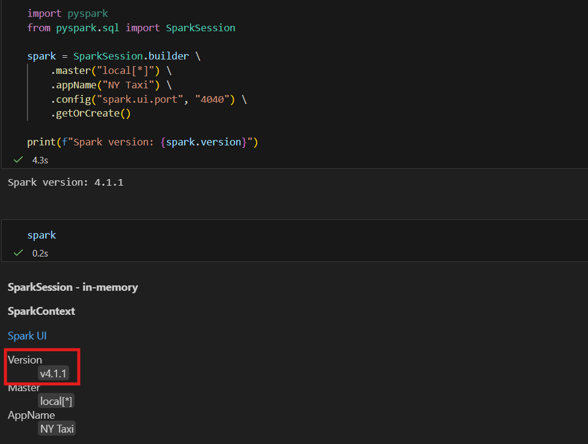
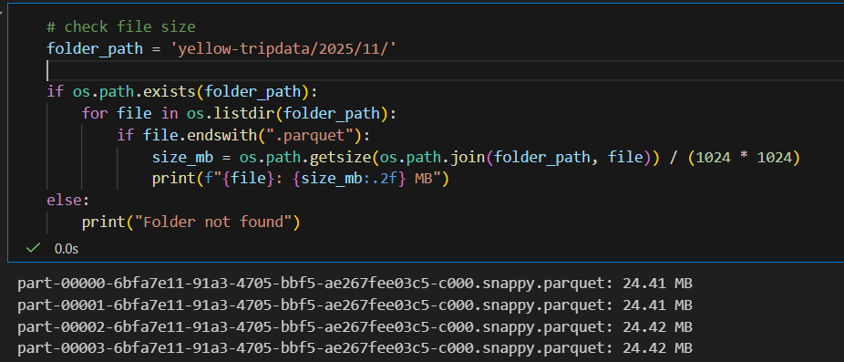
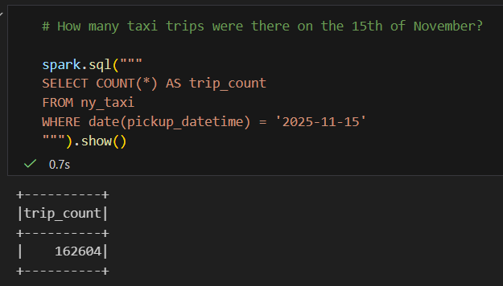
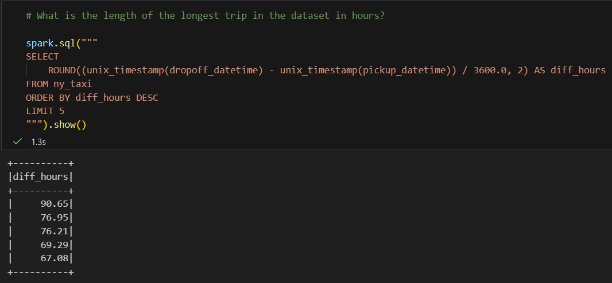
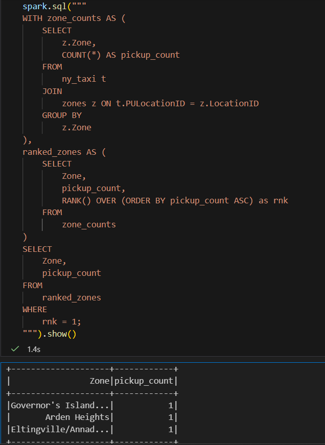

# Module 5: Data Batch with PySpark
### Tech Stack
**PySpark** : Python API for Apache Spark, enabling distributed, large-scale data processing using Python. It allows data engineers and scientists to work with familiar syntax while leveraging Spark's SQL, DataFrame, and Machine Learning modules for big data tasks.

---

# 📝 Homework

In this homework, i learned on how to do partitioning, cleaning, transforming and also load data using PySpark. We use Yellow 2025-11 data from the official website: 
```bash
# for yellow taxi data
!curl -o yellow_tripdata_2025-11.parquet https://d37ci6vzurychx.cloudfront.net/trip-data/yellow_tripdata_2025-11.parquet

# lookup table for zone id
!curl -o taxi_zone_lookup.csv https://d37ci6vzurychx.cloudfront.net/misc/taxi_zone_lookup.csv
```

### Question 1. Install Spark and PySpark
> Install Spark > Run PySpark > Create a local spark session > Execute spark.version.
> What's the output?

**✅ Answer**: <br>
The spark version that i've installed is **4.1.1**

**Explanation**: <br>
**Install Java**. Since i use windows as my os, here's the step by step how to install + run spark.
Spark 4.x requires `Java 17`. Download and unpack the `Adoptium JDK 17`:
```bash
    wget https://github.com/adoptium/temurin17-binaries/releases/download/jdk-17.0.18%2B8/OpenJDK17U-jdk_x64_windows_hotspot_17.0.18_8.zip
    unzip OpenJDK17U-jdk_x64_windows_hotspot_17.0.18_8.zip -d /c/tools/
```
The full path to JDK will `be /c/tools/jdk-17.0.18+8.`
Now let's configure it and add it to PATH (add to your `.bashrc`):

```bash
        export JAVA_HOME="/c/tools/jdk-17.0.18+8"
        export PATH="${JAVA_HOME}/bin:${PATH}"
```

Check that Java works correctly:
```bash
    java --version
```

Output:
```
openjdk 17.0.18 2026-01-20 LTS
OpenJDK Runtime Environment Temurin-17.0.18+8 (build 17.0.18+8-LTS)
OpenJDK 64-Bit Server VM Temurin-17.0.18+8 (build 17.0.18+8-LTS, mixed mode, sharing)
```
**PySpark**.
We recommend using [uv](https://docs.astral.sh/uv/) for managing Python packages:

```bash
uv init
uv add pyspark
```

Then run your scripts with `uv run`:

```bash
uv run python _your_script.py_
```

Alternatively, you can use pip:

```bash
pip install pyspark
```

Both approaches install PySpark along with a bundled Spark distribution — no separate Spark or Hadoop download needed.

> If you previously installed Spark 3.x and have `SPARK_HOME` set in your `.bashrc` (e.g. pointing to `C:/tools/spark-3.3.2-bin-hadoop3`), remove that line. PySpark 4.x bundles its own Spark, so `SPARK_HOME` is no longer needed. If the old `SPARK_HOME` is still set, PySpark 4.x will load the old JARs and fail.

**Create Local Spark Session**
Configure you local spark session using:

```python
spark = SparkSession.builder \
    .master("local[*]") \
    .appName("NY Taxi") \
    .config("spark.ui.port", "4040") \
    .getOrCreate()

# to know your spark version
print(f"Spark version: {spark.version}")
```

**Result** <br>


---

### Question 2. Yellow November 2025
> Read the November 2025 Yellow into a Spark Dataframe.
> Repartition the Dataframe to 4 partitions and save it to parquet.
> What is the average size of the Parquet (ending with .parquet extension) Files that were created (in MB)? Select the answer which most closely matches.
> - 6MB
> - 25MB
> - 75MB
> - 100MB

**✅ Answer**: <br>
Average size of parquet is **~25MB**

**Explanation**: <br>
1. Read the data using `spark.read`
2. Do the repartition into 4 partition

```python
# partition into 4
df_nytaxi = df_nytaxi.repartition(4)

# save into parquet
df_nytaxi.write.parquet('yellow-tripdata/2025/11/')
```

3. Check file size


---

### Q3.Count records
> How many taxi trips were there on the 15th of November?
> Consider only trips that started on the 15th of November.
> - 62,610
> - 102,340
> - 162,604
> - 225,768

**✅ Answer**: <br>
Number of trips that started on the 15th Novermber is **162,604**

**Explanation**: <br>
Using Spark Temporary View, i do query to get the answer

```python
# spark temporay view
df_nytaxi.createOrReplaceTempView("ny_taxi")
```

Then, do spark query: <br>


---

### Q4. Longest trip
> What is the length of the longest trip in the dataset in hours?
> - 22.7
> - 58.2
> - 90.6
> - 134.5

**✅ Answer**: <br>
The longest hours trip duration in dataset is **90.6**

**Explanation**: <br>
Query: <br>


---

### Q5.User Interface
> Spark's User Interface which shows the application's dashboard runs on which local port?
> - 80
> - 443
> - 4040
> - 8080

**✅ Answer**: <br>
By default, Spark's User Interface will run on port **4040**. We can see the port when creating `Local Spark Session`

---

### Q6. Least frequent pickup location zone
> Load the zone lookup data into a temp view in Spark. Using the zone lookup data and the Yellow November 2025 data, what is the name of the LEAST frequent pickup location Zone?
> - Governor's Island/Ellis Island/Liberty Island
> - Arden Heights
> - Rikers Island
> - Jamaica Bay
> If multiple answers are correct, select any

**✅ Answer**: <br>
**Governor's Island/Ellis Island/Liberty Island, Arden Heights**

**Explanation**:
1. After download the zone lookup data, read and load into Spark temp view using:
```python
# Read data from CSV
df_zones = spark.read \
    .option("header", "true") \
    .option("inferSchema", "true") \
    .csv("taxi_zone_lookup.csv")

# TableView
df_zones.createOrReplaceTempView("zones")
```

2. Do query to get the result. <br>



